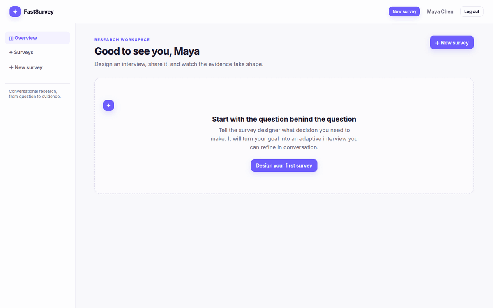

# FastSurvey

FastSurvey is an open-source, conversational research platform built with
FastHTML, HTMX, SQLite and xAI Grok. An admin describes a research goal in
chat, publishes the generated interview guide, and collects adaptive
chat-based interviews with structured answers and synthesis.

Live application: [fastsurvey.org](https://fastsurvey.org)

## Product tour

The walkthrough below was captured from a live Playwright session using Grok
4.5 for guide design, adaptive interviewing, structured extraction and the
evidence answer.



Review individual frames in [`screenshots/`](screenshots/), including the
[Grok-generated guide](screenshots/03-grok-guide.png),
[adaptive interview](screenshots/07-adaptive-interview.png),
[structured evidence](screenshots/10-structured-evidence.png), and
[evidence chat](screenshots/11-evidence-chat.png).

Regenerate the GIF from the captured PNGs with
`scripts/build_demo_gif.sh` (requires ImageMagick).

## What is included

- Chat-first survey design with a structured interview guide
- Public, mobile-first respondent interviews with choice chips
- Adaptive Grok interviewer and deterministic local fallback
- Full transcripts, structured extraction, quality signals and progress
- Survey dashboards, response review, insight chat, CSV and JSON exports
- Local accounts, Google OpenID Connect, signed sessions and public links
- FastSME-style public landing page and `/healthz` operations endpoint

## Run locally

```bash
cp .env.example .env
uv venv
uv pip install -r requirements.txt
uv run python web_app.py
```

Open <http://localhost:5019>. Register a local account from the landing page.
Without `XAI_API_KEY`, the complete product still runs using a transparent,
deterministic demo engine. Add the key to enable Grok.

## Configuration

See `.env.example`. The important values are:

- `XAI_API_KEY` — enables xAI chat completions
- `FASTSURVEY_MODEL` — defaults to `grok-4.5`
- `FASTSURVEY_SECRET` — stable, random session secret in production
- `FASTSURVEY_DB` — SQLite database path
- `GOOGLE_CLIENT_ID`, `GOOGLE_CLIENT_SECRET`, `GOOGLE_REDIRECT_URI` — optional Google OIDC

## Test

```bash
uv run pytest -q
```

## Container

```bash
docker build -t fastsurvey .
docker run --rm -p 5019:5019 -v fastsurvey-data:/data fastsurvey
```

FastSurvey is part of the open-source [FastSME](https://fastsme.com/products)
suite.
